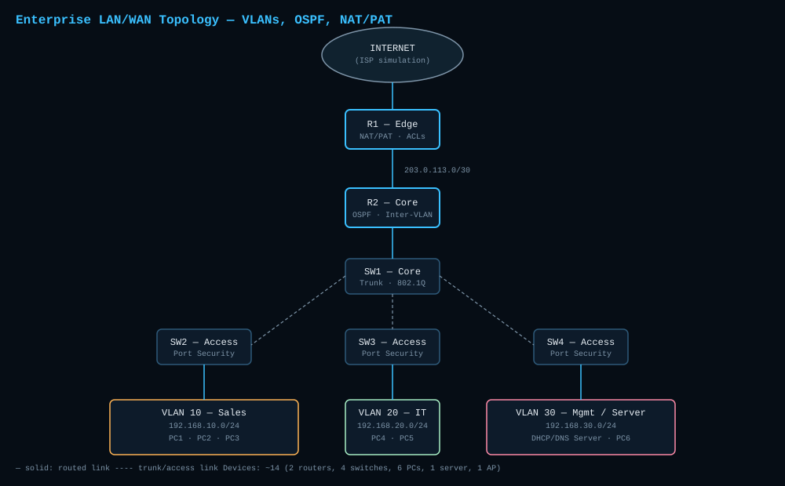

# Enterprise Network — VLANs, OSPF, NAT/PAT, ACLs, Port Security

**Status:** ✅ Complete — flagship project of this repository

## Project Description

A simulated enterprise LAN/WAN environment (~14 devices) combining VLAN segmentation, inter-VLAN routing, dynamic routing (OSPF), internet access via NAT/PAT, traffic filtering with ACLs, and access-layer port security. Built to reflect a small business network with separate departments, a management/server segment, and controlled internet egress.

## Topology



## Network Requirements

- 3 departments (Sales, IT, Management) must be logically separated but able to route to each other where permitted
- All departments must reach the internet through a single NAT/PAT boundary
- Sales must be blocked from directly accessing the Management/Server segment except for DNS/DHCP traffic
- Access switches must restrict each port to a known number of MAC addresses
- Routing between the edge and core router must use OSPF, not static routes

## Device List

| Device | Role | Model (simulated) |
|---|---|---|
| R1 | Edge router — NAT/PAT, ACLs | Cisco 4321 |
| R2 | Core router — OSPF, inter-VLAN routing | Cisco 4321 |
| SW1 | Core/distribution switch — trunking | Cisco 3650 |
| SW2 | Access switch — Sales | Cisco 2960 |
| SW3 | Access switch — IT | Cisco 2960 |
| SW4 | Access switch — Management | Cisco 2960 |
| Server1 | DHCP + DNS server | Generic Server |
| PC1–PC6 | End devices across VLANs | Generic PC |
| AP1 | Wireless access point (IT guest network) | Cisco Aironet |

## IP Addressing Table

| Segment | VLAN | Network | Gateway |
|---|---|---|---|
| Sales | 10 | 192.168.10.0/24 | 192.168.10.1 |
| IT | 20 | 192.168.20.0/24 | 192.168.20.1 |
| Management/Server | 30 | 192.168.30.0/24 | 192.168.30.1 |
| R1–R2 WAN link | — | 203.0.113.0/30 | — |
| NAT outside pool | — | 203.0.113.4–203.0.113.8 | — |

## Configuration

### VLAN & Trunking (SW1 — Core Switch)

```
vlan 10
 name SALES
vlan 20
 name IT
vlan 30
 name MANAGEMENT

interface range GigabitEthernet0/1-3
 switchport mode trunk
 switchport trunk allowed vlan 10,20,30
```

### Inter-VLAN Routing (R2 — Core Router, Router-on-a-Stick)

```
interface GigabitEthernet0/0.10
 encapsulation dot1Q 10
 ip address 192.168.10.1 255.255.255.0

interface GigabitEthernet0/0.20
 encapsulation dot1Q 20
 ip address 192.168.20.1 255.255.255.0

interface GigabitEthernet0/0.30
 encapsulation dot1Q 30
 ip address 192.168.30.1 255.255.255.0
```

### OSPF (R1 & R2)

```
router ospf 1
 network 203.0.113.0 0.0.0.3 area 0
 network 192.168.10.0 0.0.0.255 area 0
 network 192.168.20.0 0.0.0.255 area 0
 network 192.168.30.0 0.0.0.255 area 0
```

### NAT/PAT (R1 — Edge Router)

```
ip nat pool INTERNET 203.0.113.4 203.0.113.8 netmask 255.255.255.252
access-list 1 permit 192.168.0.0 0.0.255.255
ip nat inside source list 1 pool INTERNET overload

interface GigabitEthernet0/0
 ip nat outside
interface GigabitEthernet0/1
 ip nat inside
```

### ACL — Restrict Sales from Management

```
access-list 110 permit udp 192.168.10.0 0.0.0.255 192.168.30.0 0.0.0.255 eq 67
access-list 110 permit udp 192.168.10.0 0.0.0.255 192.168.30.0 0.0.0.255 eq 53
access-list 110 deny ip 192.168.10.0 0.0.0.255 192.168.30.0 0.0.0.255
access-list 110 permit ip any any

interface GigabitEthernet0/0.10
 ip access-group 110 in
```

### Port Security (Access Switches)

```
interface range FastEthernet0/1-24
 switchport mode access
 switchport port-security
 switchport port-security maximum 2
 switchport port-security violation shutdown
 switchport port-security mac-address sticky
```

## Testing & Connectivity Results

| Test | Command | Expected Result | Result |
|---|---|---|---|
| Intra-VLAN connectivity | `ping 192.168.10.x` from PC1 to PC2 | Success | ✅ Pass |
| Inter-VLAN routing (IT → Mgmt) | `ping 192.168.30.x` from PC4 | Success | ✅ Pass |
| Sales → Management block | `ping 192.168.30.x` from PC1 | Timeout (ACL deny) | ✅ Pass |
| DHCP lease | `ipconfig /renew` on PC1 | Receives 192.168.10.x address | ✅ Pass |
| OSPF neighbor | `show ip ospf neighbor` on R1 | R2 shown as FULL neighbor | ✅ Pass |
| Internet simulation | `ping 203.0.113.x` from PC1 | Success via NAT overload | ✅ Pass |
| Port security violation | Connect unauthorized device to access port | Port shuts down (err-disabled) | ✅ Pass |

## Troubleshooting Notes

- **Inter-VLAN traffic not routing initially:** subinterface encapsulation was applied before the physical interface was set to `no shutdown` — the parent interface must be up for subinterfaces to pass traffic.
- **OSPF neighbor stuck in EXSTART:** MTU mismatch between R1 and R2 GigabitEthernet interfaces — resolved by matching MTU on both ends.
- **NAT not translating:** `ip nat inside`/`ip nat outside` were reversed on the interfaces — always verify direction relative to the router's perspective, not the traffic's.
- **Port security shutting down legitimate device:** sticky MAC had already learned a previous device's address on that port — cleared with `clear port-security sticky` before reconnecting.

## Key Concepts Learned

- Router-on-a-stick inter-VLAN routing vs. Layer 3 switching trade-offs
- OSPF neighbor adjacency requirements (MTU, area, hello/dead timers)
- NAT/PAT interface direction and how overload pooling works
- Extended ACL ordering — more specific permits must come before a broader deny
- Port security violation modes and sticky MAC behavior across reconnections
